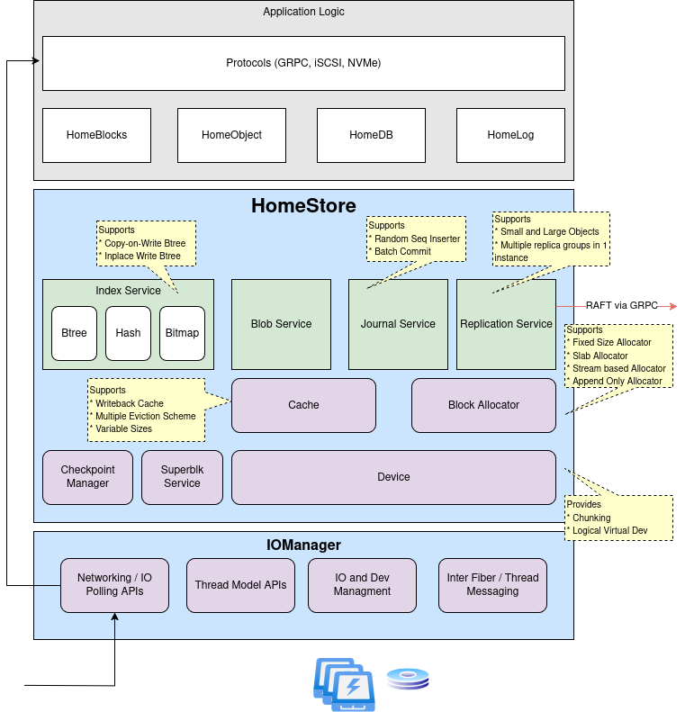

# HomeStore
[](https://github.com/hkadayam/HomeStore/actions/workflows/merge_build.yml)
[](https://codecov.io/gh/hkadayam/homestore)

Homestore is a generic *StorageEngine* upon which different *StorageSolution*s can be built. These Solutions can model
Block, K/V, Object or Database *StorageInterface*s.

The architecture is tuned towards modern storage devices and systems programming leveraging the "run to completion"
model provided by [IOManager](https://github.com/hkadayam/IOManager) to achieve "light-speed" performance. Homestore has a
pluggable model throughout making it easy to extend the functionality, tuned to specific use cases or data patterns.

A reference Object *StorageSolution* can be found in [HomeObject](https://github.com/hkadayam/HomeObject).

## Building Blocks
Several building blocks are provided by Homestore that should satisfy the majority cases for any given storage
solution. Each "service" provides a crash-resilient and persistent form of familiar data structures.

### MetaSvc (std::map)
K/V store that avoids _torn pages_. Used to store state information (e.g. Superblocks) which re-initialize application
state after reboot.

### IndexSvc (std::unordered_map)
A B+Tree used to optimize for *FAST* Reads. Value is typically the result of allocation from the ReplicationSvc.

### ReplicationSvc
An abstraction on DataSvc that replicates between application instances.

### DataSvc (new/delete)
Free flat-allocation space. Hooks are provided if a particular allocation pattern (e.g. Heap) is desirable.

### LogSvc (std::list)
Random Access circular buffer. Typically not used directly but levaraged by other Services to provide crash-resiliency.

## Architecture Diagram



## Building

### Rust Implementation

This branch (`rust/main`) contains the Rust implementation of HomeStore.

#### System Pre-requisites
* Rust 1.70 or later (install via [rustup](https://rustup.rs/))
* Cargo (comes with Rust)

#### External Dependencies
* [moka](https://github.com/moka-rs/moka) - For high-performance caching (located at `../moka++` relative to this repository)

#### Building with Cargo

Build the entire workspace:
```bash
$ cargo build
```

Build in release mode for optimized performance:
```bash
$ cargo build --release
```

Build specific packages:
```bash
$ cargo build -p homestore  # Build homestore library
$ cargo build -p sisl       # Build SISL library
$ cargo build -p iomgr      # Build IOManager
```

Run tests:
```bash
$ cargo test
```

#### Project Structure
The Rust workspace contains three main crates:
* `src/sisl/` - SISL utilities (bitsets, caching, RCU pointers)
* `src/iomanager/` - IO and reactor management with tokio/glommio backends
* `src/homestore/` - Main HomeStore library (device management, B+tree, blob storage)

---

### C++ Implementation (master branch)

The original C++ implementation is available on the `master` branch.

#### System Pre-requisites
* CMake 3.13 or later
* conan 1.x (`pipx install conan~=1`)
* libaio-dev (assuming Ubuntu)
* uuid-dev (assuming Ubuntu)

#### Dependencies
* SISL
```bash
$ git clone https://github.com/hkadayam/sisl
$ cd sisl && ./prepare.sh && conan export . oss/master
```

* IOManager
```bash
$ git clone https://github.com/hkadayam/iomanager
$ cd iomanager && ./prepare.sh && conan export . oss/master
```

#### Compilation
```bash
$ mkdir build
$ cd build

# Install all dependencies
$ conan install ..

# if it is the first time for building and some errors happens when installing dependencies,
# please try to build all dependencies by yourself
$ conan install -u -b missing ..

# Build the libhomestore.a
$ conan build ..
```

## Contributing to This Project
We welcome contributions. If you find any bugs, potential flaws and edge cases, improvements, new feature suggestions or
discussions, please submit issues or pull requests.

Contact
[Harihara Kadayam](mailto:harihara.kadayam@gmail.com)

## License Information
Primary Author: [Harihara Kadayam](https://github.com/hkadayam)

Primary Developers:
[Harihara Kadayam](https://github.com/hkadayam),
[Rishabh Mittal](https://github.com/mittalrishabh)
[Yaming Kuang](https://github.com/yamingk),
[Brian Szmyd](https://github.com/szmyd),

Licensed under the Apache License, Version 2.0 (the "License"); you may not use this file except in compliance with the
License. You may obtain a copy of the License at https://www.apache.org/licenses/LICENSE-2.0.

Unless required by applicable law or agreed to in writing, software distributed under the License is distributed on an
"AS IS" BASIS, WITHOUT WARRANTIES OR CONDITHomeStore OF ANY KIND, either express or implied. See the License for the
specific language governing permissions and limitations under the License.
